# 初入龙岛：Dragon City 基础攻略

## 一、 基础资源管理

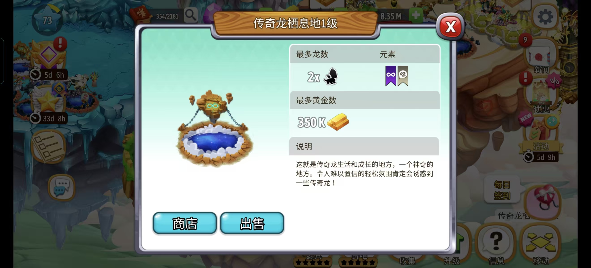

* **黄金**：前期稀缺，后期懒得看一眼。多把普龙喂养至10~15级，慢慢拿黄金即可。如果上线间隔时间长，可以选择多造**传奇栖息地**，这是黄金容量最高的栖息地。
* **食物**：无论前后期都稀缺，0级到70级需要**113M**食物。前期可以用黄金在食品农场产出食物作过渡，据上线时间选择相应的作物即可。
* **宝石**：不乱用，推荐用于开孵化位和开岛。超级育种树和幼儿园不推荐买。特定时段岛屿会有打折，包括钻石和黄金折扣。

> **心理准备：**
> 虽言DC已活10载但技术人员和智障没什么区别，如遇到什么bug也不要见怪

> **客服渠道：** [官方客服中心](https://socialpoint.helpshift.com/hc/zh/7-dragon-city/contact-us/)（游戏内客服通常不回）。

> **QQ交流群：** 755083996

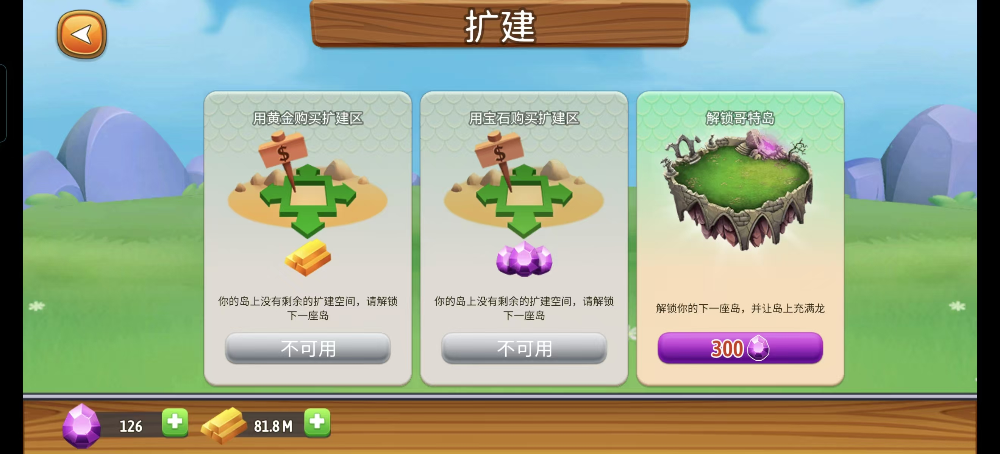

---

## 二、 食物龙-正负极

**正极龙 (Positive Dragon)** 与 **负极龙 (Negative Dragon)** 是游戏内产出食物效率最高的龙。后期不依赖食物建筑，而是靠正负极产出食物，大佬一般都需要100只以上。正负极同时也是很好的交易货币。

*注：食物产出与黄金产出互不冲突，食物龙每 6 小时可收集一次。*

## 刷正负极

### 1.杀龙数升阶
* 把正负极拉到15~30级后，通过刷击杀让其升阶，升到紫三可获得总计60球。
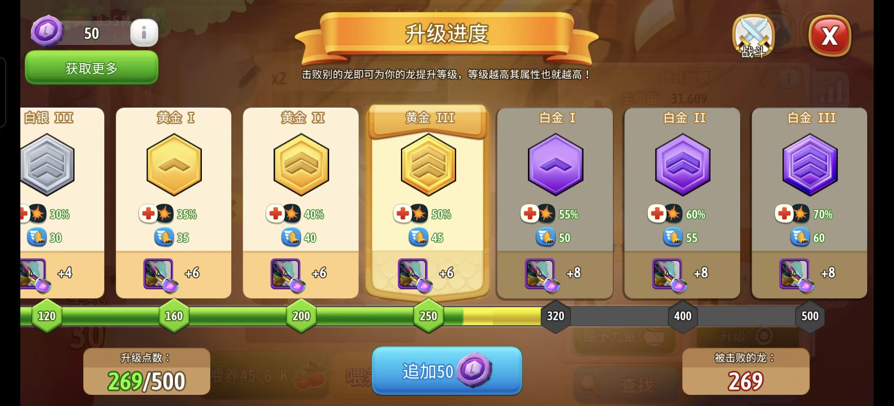

### 2. 升星方式
* **万能升星**：0~5星所需球数：120、200、320、540、800。在每周三**升星时光**中可以全额使用万能球升级。也有人用万能给正负升星后召回，以召唤更多正负龙。
* **半万能升星**：前0~4星使用正负龙本体球，5星升级时使用**800万能L**升级召回，可赚800本体球。二者依据个人实力选择使用.

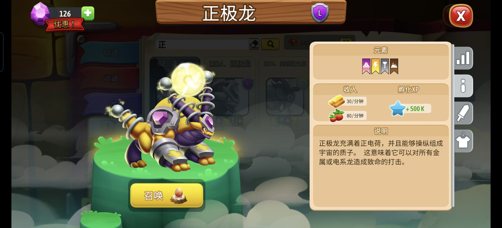
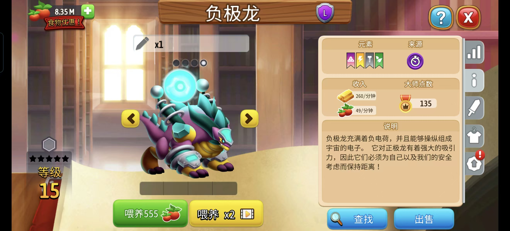

---

## 三、 氪金与联盟建议

### 氪金指南
**新手不推荐氪金**（无论是钻石还是通行证）。
* **食物广告**：等级提升后，每小时可通过看广告获得约 2M 食物，这是极重要的来源。
* **氪金陷阱**：一旦选择氪金，食物广告的出现频率会大幅减少。

> **【大B语录】**
> “如不成牢玩即不氪，看 TV 拿食物是也。前期氪金者，群笑柄是也。”

### 联盟系统
16 级解锁。建议加入群内四大联盟：**长缨、星火、苍龙、燎原**。
* **奖励**：联盟任务可获得食物、交易药甚至宝石（最高 165 宝石）。
* **助力**：进盟后可请求成员赠送一组正负极（7 个球）。之后攒够 93 颗万能 L 球，即可在生命之树召唤。

---

## 四、 战力培养原则

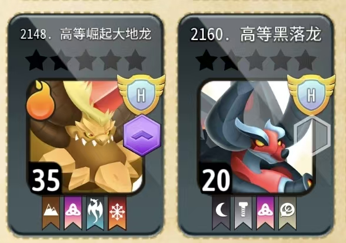

**战力原则**：
新手不要乱用食物在普龙（无技能龙）身上。

**如何判断技能龙**：
查看龙图左上角标志——有标志的是技能龙，无标志的是普龙。但技能龙也不全都有用。

**前期过渡龙**：
前期可以通过召唤大量火焰龙，在生命之树里召回。将两头火焰龙升级至5星，分别给与2个黄色育种，或者给一头火焰龙4个黄色育种进行繁殖，可以得到新手过渡龙——宇宙爆炸龙。

**真正的强度龙**：
真正好用的强度龙一般是VIP龙，无其他获得方式。因此萌新需要多养正负极，用正负极和有VIP龙的玩家交易，换取强度龙。正负极是非常好的交易货币。
如果是老玩家回归，手上有比较老的龙，可以问问收集癖，有些能换到强龙。

>群内收集癖T表：大B，清风

> **【大B语录】**
>老外好交易，垃圾都给老外收。

---

## 五、强度龙T表

>强度龙分有皮和无皮，皮肤一般通过活动获取，或氪金获取（网页限时返厂或通行证）。

**有皮H龙**：
* **高等灾劫女祭司（灾女）【辅助】**
> 如想氪金买皮：推荐逃二，普鲁斯，尖刺，沉默，暴击这些是可以入手的

**无皮H龙**：
* **高等无首逃避龙（逃避二）【大C】**：50%的技能闪避概率使其变得可怕，有皮更好
* **战略家普鲁斯【半C】**：训练后获得三个技能，两个技能可回血和概率额外回合。
* **高等灾劫男爵龙（地雷）【辅助】**：因其增伤标记和死亡复活队友闻名，是闻风丧胆的变态玩意。

**M龙**：
* **灾劫舞者【辅助】**：灾劫系列的增伤标记和给盾，使其成为一个非常不错的新手龙。男爵是他的上位替代。
* **灾劫缝合【C】，尖刺狂风【仅前期】**

**L龙**：
* **尖刺天马【辅助】**：前后期都好用，技能反伤无敌，三星40级就够用。

## 六、生命之树

**解锁条件**：
* **召唤**：11级；召回：23级；升星：23级
>不建议召唤与升星普龙，这两个栏位留给关键龙即可。召回则比较随意。

## 七、贴纸卡包

**能做满就做满，白嫖不香吗？**
> **【大B语录】**
>卡包留周四开，开出5停止，不必担心时间到卡包自动第二天领取。

## 八、跑圈与竞技场

**跑圈**：每轮要求的任务不一，参考ditlep.com/heroicrace#。部分任务有冷却，要注意。

>任务涵盖：收集黄金、食物，育种，孵化，联盟

**竞技场**：当期通行证开到那五只，会是下赛季加成的

...未完待续

---

> **【大蔡语录】**
>三人行，游戏理解不行，问吾。

> **编者：冰麒麟**是也

---

## 九、其他资源

>各等级食物盒子

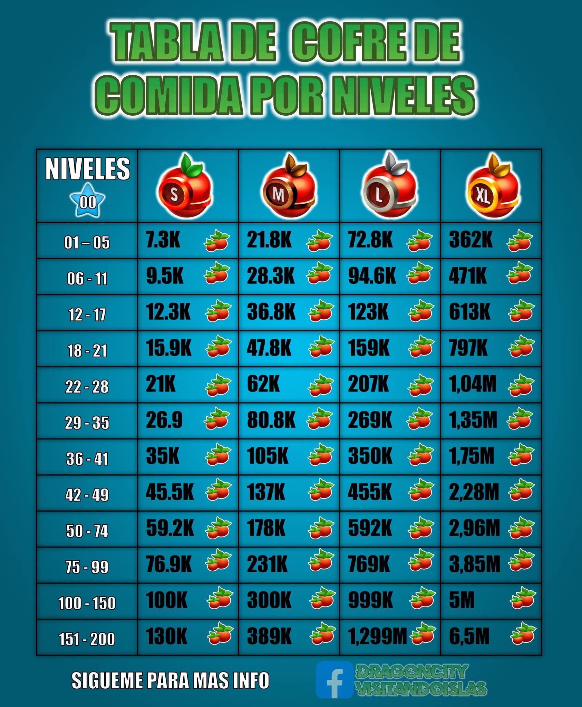

>每周五召唤时光

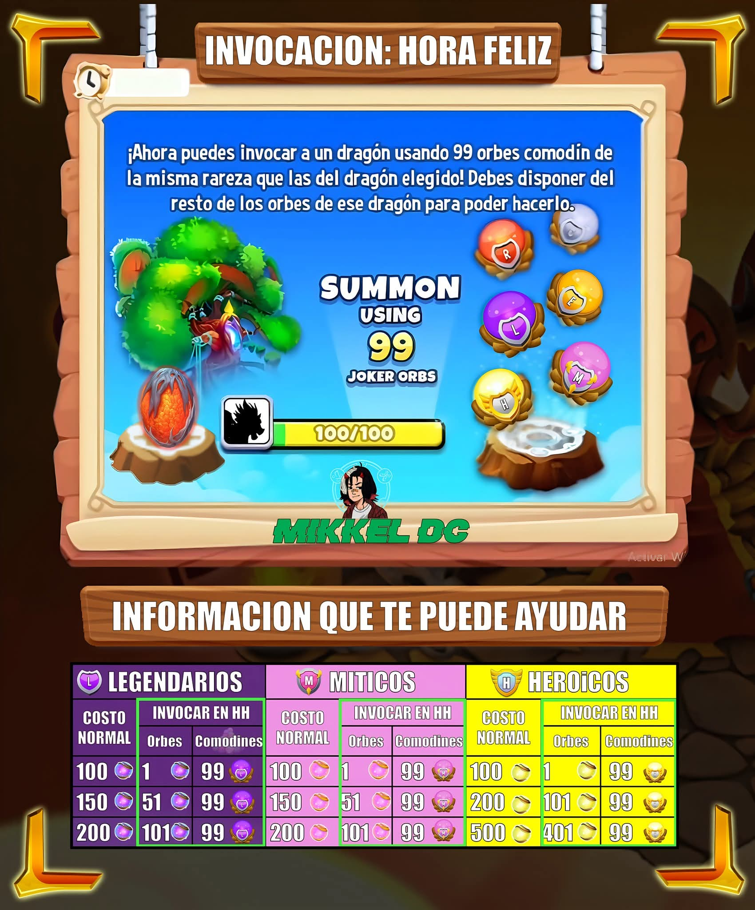

>每周三召唤时光

>更多资源

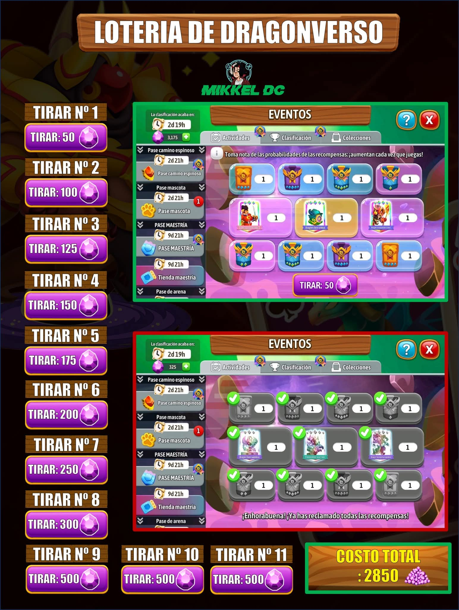

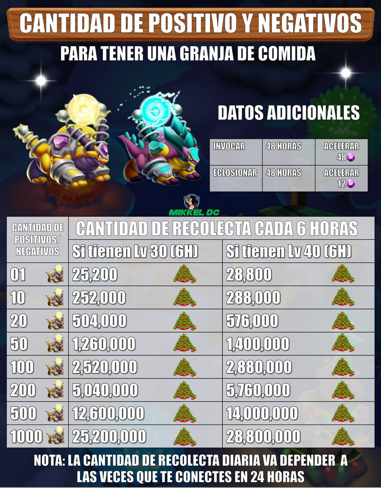

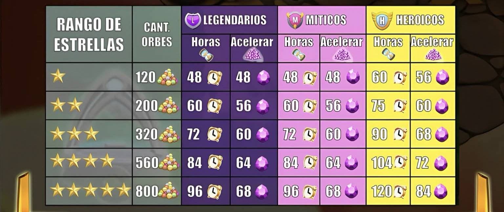